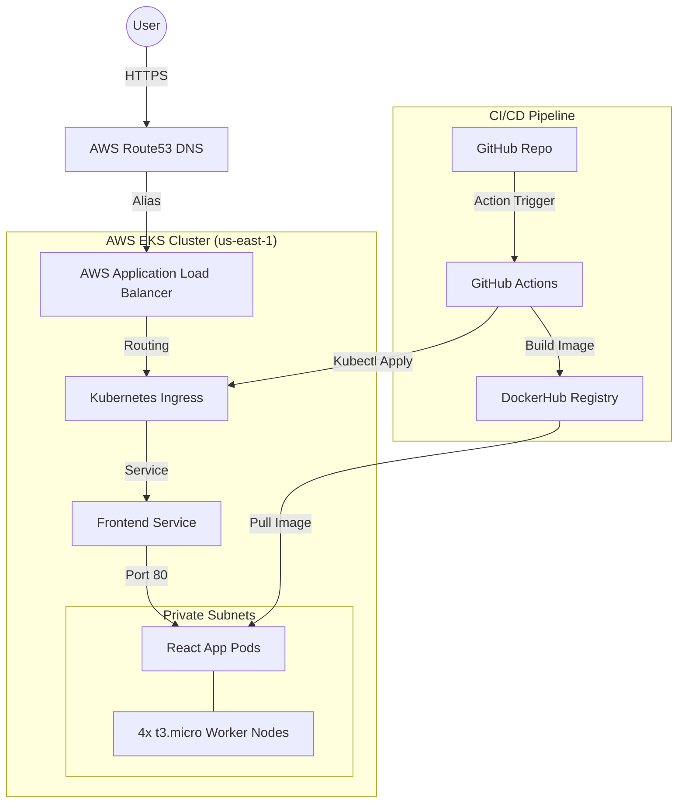

# 🏆 Project Completion: Zomato DevOps Deployment to AWS

Congratulations, Rajesh! You have successfully deployed a production-grade React application to AWS using a modern DevOps toolchain. This document provides a full overview of the architecture and how to manage it moving forward.

## 🏗️ Architecture Overview

The following diagram shows how your application is hosted and how traffic flows from the user to your app:



## 🛠️ Technology Stack

| Component | Technology | Description |
| :--- | :--- | :--- |
| **Cloud Provider** | AWS | Hosting environment (VPC, EKS, Route53, ACM). |
| **IaC** | Terraform | Automated provisioning of all AWS resources. |
| **Containerization**| Docker | Multi-stage build for the React frontend (Node 18 & Nginx). |
| **Orchestration** | Kubernetes (EKS) | Management of the application lifecycle and scaling. |
| **CI/CD** | GitHub Actions | Automated build, test, and deployment on every push. |
| **Security** | ACM (SSL/TLS) | Fully managed HTTPS encryption for your domain. |
| **Networking** | ALB Controller | Native AWS Load Balancer integration for Kubernetes. |

## 🚀 Key Features Implemented

1.  **Zero-Downtime Deployment:** GitHub Actions performs a rolling update, ensuring your app stays online while new code is deploying.
2.  **Infrastructure as Code:** Every server, subnet, and policy is defined in Terraform files. You can recreate your entire environment with one command.
3.  **Automatic Scaling:** Your EKS cluster is configured with an Auto Scaling Group that can scale from 2 to 5 nodes if traffic increases.
4.  **Auto-HTTPS:** Any user visiting `http://tankandpets.shop` is automatically redirected to the secure `https://` version.
5.  **Optimized Container:** Used a lightweight Alpine-based Docker image to ensure fast startup and low resource usage.

## 📖 Maintenance & Management

### 1. Updating the Application
Simply make changes to your code, commit, and push:
```bash
git add .
git commit -m "Update app feature"
git push origin main
```
GitHub Actions will automatically handle the rest!

### 2. Checking Cluster Health
You can use the `kubectl` tool I installed for you:
*   **Check Pods:** `kubectl get pods -n zomato`
*   **Check Nodes:** `kubectl get nodes`
*   **Check Logs:** `kubectl logs -l app=zomato-frontend -n zomato`

### 3. Cleaning Up
If you ever want to stop the project and avoid AWS costs, run:
```bash
cd terraform
terraform destroy -auto-approve
```

---

**This is a massive milestone in your DevOps journey. Great work!** 🏁✨
