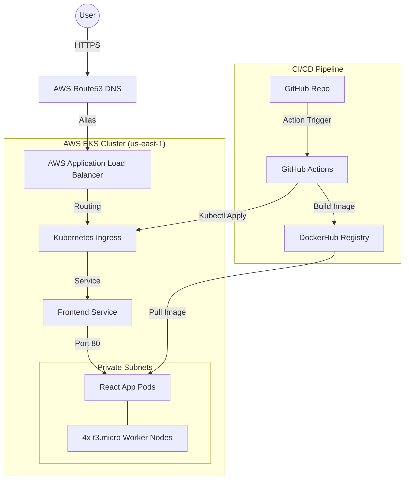

# 🚀 Zomato Pro: Enterprise DevOps Deployment on AWS

[](https://github.com/rajeshtutta/zomato/actions)
[](https://aws.amazon.com/)
[](https://www.terraform.io/)
[](https://www.docker.com/)

This repository contains a production-grade deployment of the Zomato React application. The project showcases a full-scale DevOps pipeline, including Infrastructure as Code (IaC), Containerization, Orchestration, and automated CI/CD.

🔗 **Live Demo:** [https://tankandpets.shop](https://tankandpets.shop)

---

## 🏗️ Architecture Design

The architecture is built for high availability and scalability within the AWS Cloud.



## 🛠️ Tech Stack & Tools

*   **Infrastructure:** Terraform (VPC, EKS, Subnets, IAM, NAT Gateway)
*   **Orchestration:** Amazon EKS (Kubernetes 1.28)
*   **Containerization:** Docker (Multi-stage builds)
*   **CI/CD:** GitHub Actions
*   **Networking:** AWS Load Balancer Controller (ALB)
*   **Security:** AWS Certificate Manager (ACM - SSL/TLS)
*   **DNS:** Route53

## 🚀 Key Features

*   ✅ **End-to-End Automation:** Fully automated deployment from code commit to production.
*   ✅ **Secure by Design:** Private subnets for compute nodes and HTTPS encryption for users.
*   ✅ **Cost Optimized:** Balanced for Free Tier using `t3.micro` nodes with scaled ENI capacity.
*   ✅ **Zero-Downtime:** Rolling updates ensure 100% availability during deployments.
*   ✅ **IaC Governance:** Entire infrastructure managed through version-controlled Terraform.

## 📁 Project Structure

```text
├── .github/workflows/   # CI/CD Pipeline (GitHub Actions)
├── aws-k8s/            # Kubernetes Manifests (Deployment, Ingress)
├── terraform/          # Infrastructure as Code (AWS Provisioning)
├── src/                # React Frontend Source Code
├── Dockerfile          # Multi-stage Docker Build
└── PROJECT_WALKTHROUGH.md # Detailed technical documentation
```

## 📝 How to Deploy

1.  **Infrastructure:** Initialize and apply Terraform.
    ```bash
    cd terraform
    terraform init
    terraform apply -auto-approve
    ```
2.  **Pipeline:** Add `AWS_ACCESS_KEY_ID`, `AWS_SECRET_ACCESS_KEY`, `DOCKER_USERNAME`, and `DOCKER_PASSWORD` to GitHub Secrets.
3.  **Push:** Push to `main` branch to trigger the automated deployment.

---

## 👨‍💻 Author

**Rajesh Tutta**  
*DevOps Engineer & Cloud Architect*


---
© 2026 Rajesh Tutta. All rights reserved.
